# ERD — Sources Sofia (staging)

Sources Sofia extraites de MongoDB via BigQuery. Les tables `Soc_2`, `Soc_3`, `Soc_4` représentent des sociétés différentes avec une structure identique — elles sont regroupées par entité logique dans ce diagramme.

```mermaid
erDiagram

    stg_entites {
        INT64     ID                          PK
        INT64     _id
        STRING    Reference
        STRING    Libelle
        STRING    Libelle_Court
        STRING    Libelle_Lieu
        STRING    Libelle_Lieu_Site
        STRING    Libelle_Lieu_Court
        STRING    Code_Analytique
        STRING    CSecteur
        STRING    Diplome
        BOOL      Tronc_Commun
        BOOL      Inscription_En_Ligne
        INT64     IDLieu_Site
        TIMESTAMP Debut
        TIMESTAMP Fin
        TIMESTAMP Date_Debut_Prevue
        TIMESTAMP Date_Fin_Prevue
        TIMESTAMP _extracted_at
        INT64     pilote_id
        STRING    pilote_nom
        STRING    pilote_prenom
        STRING    pilote_civilite
        STRING    pilote_reference
        INT64     referent_id
        STRING    referent_nom
        STRING    referent_prenom
        STRING    referent_civilite
        STRING    referent_reference
        INT64     specialite_id
        STRING    specialite_libelle
        STRING    specialite_reference
        INT64     objectif_general_id
        STRING    objectif_general_libelle
        STRING    objectif_general_libelle_court
        STRING    objectif_general_reference
    }

    stg_inscrite {
        INT64    ID                          PK
        INT64    IDAction                    FK
        INT64    IDParcours_Groupe
        STRING   Code_Analytique_Parcours
        STRING   Type_Region
        STRING   Code_Region
        STRING   Libelle_Parcours
        STRING   Libelle_Court_Parcours
        STRING   Libelle_Parcours_Groupe
        DATETIME Date_Entree
        DATETIME Date_Sortie
        DATETIME Date_Sortie_Previsionnelle
        STRING   CIR
        STRING   Type_apprentissage
        INT64    stg_stagiaire_id            FK
        INT64    stg_individu_id
        STRING   stg_nom
        STRING   stg_prenom
        STRING   stg_nom_naissance
        DATE     stg_date_naissance
        STRING   stg_reference
        STRING   stg_civilite
        STRING   stg_charge_affaires
        STRING   stg_email_pro
        STRING   stg_email_perso
        STRING   stg_ville
        STRING   stg_code_postal
        INT64    fr_formateur_id             FK
        STRING   fr_nom
        STRING   fr_prenom
        STRING   fr_nom_jeune_fille
        DATE     fr_date_naissance
        STRING   fr_email_pro
        STRING   fr_ville
        STRING   fr_code_postal
        STRING   conv_numero_financeur
        STRING   conv_libelle2
        STRING   conv_nom
        STRING   conv_sigle
        STRING   conv_num_lot
        STRING   conv_date_rupture
        INT64    conv_id_societe
        STRING   conv_financeur
        STRING   conv_commercial
        STRING   source_table
    }

    stg_presence {
        INT64  source_id                     PK
        INT64  id_action                     FK
        INT64  id_module
        STRING date_date
        STRING source_debut
        STRING source_fin
        FLOAT  source_duree
        STRING source_libelle
        STRING source_libelle_court
        STRING source_libelle_lieu
        INT64  id_lieu
        STRING salles
        STRING materiels
        BOOL   visibilite_stagiaire
        STRING libelle_action
        INT64  inscription_id                FK
        STRING inscription_internal_id
        STRING type_region
        STRING code_region
        STRING code_analytique_parcours
        INT64  id_parcours_groupe
        STRING libelle_parcours
        STRING libelle_court_parcours
        STRING libelle_parcours_groupe
        STRING libelle_court_parcours_groupe
        DATE   date_entree
        DATE   date_sortie
        STRING seance_internal_id
        STRING seance_libelle
        STRING seance_libelle_court
        STRING type_seance
        STRING libelle_type_seance
        STRING module_prevu
        FLOAT  duree_seance
        STRING heure_debut
        STRING heure_fin_seance
        BOOL   distancielle
        BOOL   personnalisee
        BOOL   seance_action_principale
        STRING signature
        STRING type_absence_libelle
        INT64  type_absence_id
        FLOAT  duree_absence
        STRING debut_absence
        STRING fin_absence
        INT64  stagiaire_id                  FK
        STRING stagiaire_nom
        STRING stagiaire_prenom
        STRING stagiaire_reference
        INT64  convention_id                 FK
        STRING convention_reference
        STRING convention_libelle
        STRING convention_libelle2
        STRING convention_numero_interne
        STRING convention_numero_financeur
        INT64  convention_id_societe
        INT64  client_id
        STRING client_nom
        STRING client_reference
        INT64  financeur_id
        STRING financeur_nom
        STRING financeur_reference
        INT64  intervenant_id
        STRING intervenant_nom
        STRING intervenant_prenom
        STRING intervenant_reference
        STRING intervenant_civilite
        STRING intervenant_signature
        STRING source_table
    }

    stg_convention {
        INT64     IDConvent                    PK
        INT64     _id
        STRING    Reference
        STRING    Libelle
        STRING    Libelle2
        STRING    Numero_interne
        STRING    Numero_financeur
        STRING    Num_Bon_Commande
        STRING    Numero_lot
        STRING    Etat_Convention
        STRING    Validation_Convention
        STRING    Type_Convention
        STRING    Groupe_Ou_Individuelle
        STRING    Regle_Facturation
        STRING    Libelle_1ere_Regle_CA
        STRING    Code_Secteur_OF
        STRING    CodeComptable
        STRING    Compte_produit
        STRING    Libelle_Compte_produit
        STRING    AuxiliaireComptable
        STRING    ContactFinanceur
        STRING    Commercial
        STRING    LieuFormation
        STRING    montants_convention
        FLOAT     Total_HT_Conv
        FLOAT     Total_TTC_Conv
        FLOAT     Total_TVA_Conv
        FLOAT     NPEC
        FLOAT     Montant_Frais_1EREQUIP
        STRING    Libelle_Frais_1EREQUIP
        INT64     Code_CPNE_Client
        STRING    Libelle_CPNE_Client
        BOOL      Commune
        BOOL      Liee
        BOOL      Archivee
        BOOL      Terminee
        BOOL      ConventionIota
        BOOL      ConventionRegion
        BOOL      Echeances_Indiv
        BOOL      Compte_Present_Compta
        INT64     tva_taux
        INT64     tva_id
        STRING    Date_Signee
        TIMESTAMP Date_Debut
        TIMESTAMP Date_Fin
        TIMESTAMP _extracted_at
        STRING    financeur_nom
        STRING    financeur_reference
        INT64     financeur_id
        INT64     financeur_internal_id
        STRING    client_nom
        STRING    client_reference
        INT64     client_id
        INT64     client_internal_id
        STRING    contact_client_nom
        INT64     contact_client_id
        STRING    titulaire_marche_nom
        STRING    titulaire_marche_siret
        STRING    prestataire_nom
        STRING    prestataire_siret
        STRING    prestataire_email
        STRING    representant_nom
        STRING    representant_prenom
        STRING    representant_civilite
        STRING    origine_produit_bpf_libelle
        STRING    source_table
    }

    int_convention_montants {
        INT64  montant_id         PK
        INT64  IDConvent          FK
        STRING convention_reference
        STRING convention_numero_financeur
        FLOAT  montant_ht
        FLOAT  montant_ttc
        FLOAT  montant_tva_montant
        INT64  montant_tva_taux
        INT64  montant_tva_id
        STRING source_table
    }

    stg_stage {
        INT64     ID                      PK
        INT64     _id
        INT64     IDAction                FK
        STRING    CodeAnalytique
        STRING    Libelle
        STRING    Libelle_Action
        STRING    Libelle_Fonction
        STRING    IDFonction
        STRING    Libelle_Rome
        STRING    CodeRome
        INT64     IDRome
        BOOL      Archive
        TIMESTAMP DateDebut
        TIMESTAMP DateFin
        FLOAT     Duree
        TIMESTAMP _extracted_at
        STRING    visites
        INT64     stagiaire_id            FK
        STRING    stagiaire_nom
        STRING    stagiaire_prenom
        STRING    stagiaire_civilite
        STRING    stagiaire_email_perso
        STRING    stagiaire_mobile_perso
        TIMESTAMP stagiaire_date_naissance
        INT64     entreprise_id
        STRING    entreprise_nom
        STRING    entreprise_sigle
        STRING    entreprise_reference
        STRING    entreprise_email
        STRING    entreprise_telephone
        STRING    entreprise_ville
        INT64     entreprise_code_postal
        STRING    entreprise_pays
        INT64     tuteur_centre_id
        STRING    tuteur_centre_nom
        STRING    tuteur_centre_prenom
        STRING    tuteur_centre_email
        INT64     tuteur_stage_id
        STRING    tuteur_stage_nom
        STRING    tuteur_stage_prenom
        STRING    tuteur_stage_email
        INT64     maitre_stage_id
        STRING    maitre_stage_nom
        STRING    maitre_stage_prenom
        STRING    maitre_stage_email
        INT64     signataire_id
        STRING    signataire_nom
        STRING    signataire_prenom
        STRING    signataire_email
        STRING    source_table
    }

    stg_entites     ||--o{ stg_inscrite            : "stg_inscrite.IDAction = stg_entites.ID"
    stg_entites     ||--o{ stg_presence            : "stg_presence.id_action = stg_entites.ID"
    stg_inscrite    ||--o{ stg_presence            : "stg_presence.inscription_id = stg_inscrite.ID"
    stg_convention  ||--o{ stg_presence            : "stg_presence.convention_id = stg_convention.IDConvent"
    stg_convention  ||--o{ int_convention_montants : "int_convention_montants.IDConvent = stg_convention.IDConvent"
    stg_inscrite    }o--|| stg_convention          : "stg_inscrite.conv_numero_financeur = stg_convention.Numero_financeur (embed)"
    stg_entites     ||--o{ stg_stage               : "stg_stage.IDAction = stg_entites.ID"
```

## Notes

| Table | Sociétés | Statut |
|---|---|---|
| `stg_entites` | — | Colonnes explicites + STRUCTs aplatis |
| `stg_inscrite` | Soc_2, Soc_3, Soc_4 | Colonnes explicites |
| `stg_presence` | Soc_2, Soc_3, Soc_4 | Colonnes explicites |
| `stg_convention` | Soc_2, Soc_4 | Colonnes explicites + STRUCTs aplatis |
| `stg_stage` | Soc_2, Soc_3 | Colonnes explicites + STRUCTs aplatis, `Visites` en JSON string |
| `stg_facture` | — | Supprimé |
| `int_convention_montants` | Soc_2 + Soc_4 | UNION ALL, 1 ligne par montant (UNNEST de Montants_Convention) |

## Particularités MongoDB

- Les champs `STRUCT` (ex: `Financeur`, `Client`) sont aplatis avec notation pointée directement en staging.
- Les champs `ARRAY<STRUCT>` (ex: `Montants_Convention`) sont gardés en JSON string en staging et unnestés dans un modèle intermédiaire dédié (`int_convention_montants`) pour préserver le grain de la table source.
