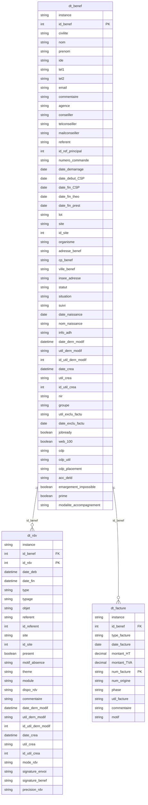

# ERD — Bénéficiaires

```mermaid
erDiagram
  dt_benef {
    string instance
    int id_benef PK
    string civilite
    string nom
    string prenom
    string ide
    string tel1
    string tel2
    string email
    string commentaire
    string agence
    string conseiller
    string telconseiller
    string mailconseiller
    string referent
    int id_ref_principal
    string numero_commande
    date date_demarrage
    date date_debut_CSP
    date date_fin_CSP
    date date_fin_theo
    date date_fin_prest
    string lot
    string site
    int id_site
    string organisme
    string adresse_benef
    string cp_benef
    string ville_benef
    string insee_adresse
    string statut
    string situation
    string suivi
    date date_naissance
    string nom_naissance
    string info_adh
    datetime date_dern_modif
    string util_dern_modif
    int id_util_dern_modif
    datetime date_crea
    string util_crea
    int id_util_crea
    string nir
    string groupe
    string util_exclu_factu
    date date_exclu_factu
    boolean jobready
    boolean web_100
    string cdp
    string cdp_util
    string cdp_placement
    string acc_deld
    boolean emargement_impossible
    boolean prime
    string modalite_accompagnement
  }

  dt_rdv {
    string instance
    int id_benef FK
    int id_rdv PK
    datetime date_deb
    datetime date_fin
    string type
    string typage
    string objet
    string referent
    int id_referent
    string site
    int id_site
    boolean present
    string motif_absence
    string theme
    string module
    string dispo_rdv
    string commentaire
    datetime date_dern_modif
    string util_dern_modif
    int id_util_dern_modif
    datetime date_crea
    string util_crea
    int id_util_crea
    string mode_rdv
    string signature_envoi
    string signature_benef
    string precision_rdv
  }

  dt_facture {
    string instance
    int id_benef FK
    string type_facture
    date date_facture
    decimal montant_HT
    decimal montant_TVA
    string num_facture PK
    string num_origine
    string phase
    string util_facture
    string commentaire
    string motif
  }

  dt_benef ||--o{ dt_rdv : "id_benef"
  dt_benef ||--o{ dt_facture : "id_benef"
```